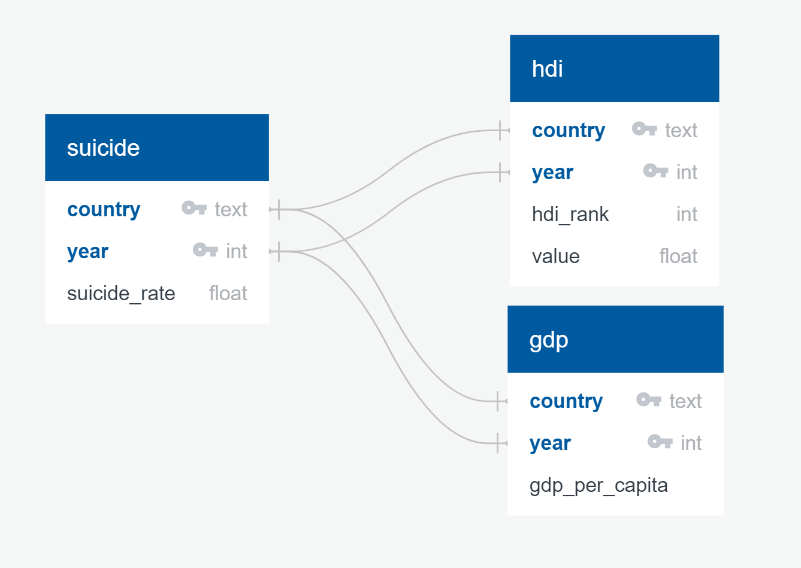

# Project-2

Combining the gross domestic product, human development index and suicide rates of countries from 1990 to 2019.

# Extract -- Sources of Data (Raw Data Folder)

All the data was in .csv format and was extracted by downloading directly from the source. The data was uploaded using pandas to jupyter notebook.

  ### GDP 
  Source: Organisation for Economic Co-operation and Development (OECD) 

  Link: https://data.oecd.org/gdp/gross-domestic-product-gdp.htm

  File Name: GDP_capita.csv

  ### Human Development Index
  Source: United Nations Development Program

  Link:http://hdr.undp.org/en/indicators/137506

  File Name: Human Development Index (HDI).csv

  ### Suicide Rates
  Source: Organisation for Economic Co-operation and Development (OECD) 

  Link: https://data.oecd.org/healthstat/suicide-rates.htm

  File Name: suicide_rates.csv

# Transform

## Jupyter Notebooks (Code Folder)
**GDP_data_elt:** this notebook works on tranforming the GDP/Capita file, and exporting the cleaned file to the Resources folder.

**Transform_HDI:** this notebook works on tranforming the HDI file, and exporting the cleaned file to the Resources folder.

**suicide_by_country:** this notebook works on tranforming the suicide rates file, and exporting the cleaned file to the Resources folder.

**Create_Database:** this notebook creates a Postgres connection to create the database(suicide_db), the tables needed (hdi,gdp,suicide), loads the cleand data from the resources folder and load the data into the appropriate tables.

## Data Clearing/Transformation

### HDI Data
The HDI data had a different data source from the suicide rates and GDP data, therefore, steps were needed to bring it to a similar format as the other two sources. 

The following are some of the key steps taken to make this data set ready to use:

    -The file code could not be decoded by the UTF-8 format and needed to apply 'unicode_escape' to load the file appropriately
    -Remove columns with NaN Values (every alternate column was NaN), delete unecessary rows, and other NaN values
    -The column names were the Year and the the data was in a 'pivot' format, used the melt function to transform the columns to be included as row values
    -The naming convention countries in the data base was different from the other databases. Efforts were made to identify those discrepancy and replace the values in the HDI data set using the HDI_countries_CD.csv file in Raw Data.

### GDP & Suicide
    -Selecting relevant columns from the “GDP” and “Suicide” dataset, such as location code, year, and value and saving them in to new datasets
    -Renaming columns in the new datasets
    -Renaming columns in “country datasets”
    -Merging new “GDP” and “Suicide”  datasets with “country” dataset on “Location code” to add a full country name to “GDP” and “Suicide”   datasets
    -Removing any missing (NaN) values from “GDP” and “Suicide”  datasets
    -Saving the outputs  to csv files .

# Load 

## Final Production Database in Postgres: 

### Gross Domestic Product:

Definition: Gross domestic product (GDP) is the standard measure of the value added created through the production of goods and services in a country during a certain period.
Measured as USD per Capita

**Columns:** country, year, gdp_per_capita

### Human Development Index:

Definition: A composite index measuring average achievement in three basic dimensions of human development—a long and healthy life, knowledge and a decent standard of living.

**Columns:** hdi_rank, country, year, value

### Suicide Rates:
Definition: Suicide rates are defined as the deaths deliberately initiated and performed by a person in the full knowledge or expectation of its fatal outcome.
Measured per 100,000 persons.

**Columns:** country, year, country_code, suicide_rate

### Project Motivation

To analyze a country's suicide rate as comapred to the gross domestic product and human development.

### Sample Questions that can be answered post ETL:

1. Top 10 suicide rates by country (using suicide table: using country and suicide_rate columns)
2. Avg suicide rate of the world (using suicide table: using country and suicide_rate columns)
3. suicide rates for the 10 countries with lowest gdp (using suicide & gdp tables: using country, suicide_rate, gdp columns)
4. suicide rates for the 10 countries with the highest gdp (using suicide & gdp tables: using country, suicide_rate, gdp columns)
5. suicide rates for the 10 countries with the lowest HDI (using suicide & hdi tables: using country, suicide_rate, hdi columns)
6. suicide rates for the 10 countries with the highest HDI (using suicide & hdi tables: using country, suicide_rate, hdi columns)

### ERD Diagram

